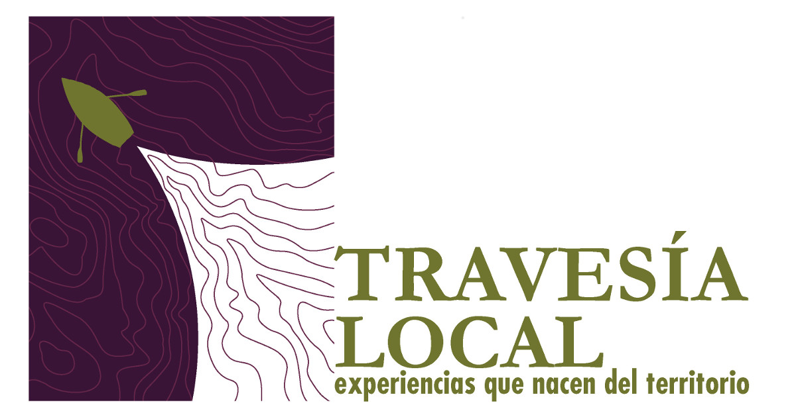
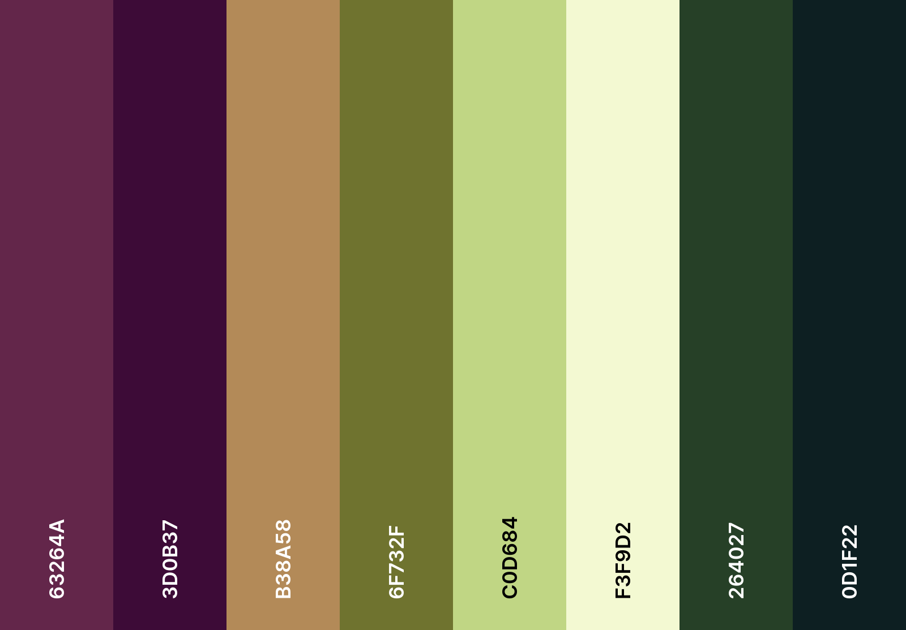
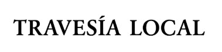
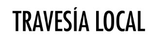
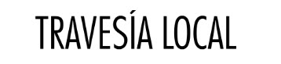

# Travesia Local

<a href="https://travesialocal.cl">Visita el sitio desplegado</a>
 

====  ⚠ Nota sobre Licencia y Propiedad Intelectual ⚠  ====
 
 

El código fuente de este proyecto está disponible bajo la Licencia MIT. Sin embargo, todos los recursos visuales (fotografías, videos e ilustraciones) son propiedad exclusiva de la autora y fundadora de Travesía Local.

Está prohibida la reproducción total o parcial de las imágenes sin autorización expresa.

Para más detalles, consulte la sección <a href="https://travesialocal.cl/terminos-de-uso">Términos de uso</a> en el sitio web.
 
 

### Guía de estilo y diseño

Este sitio fue construido siguiendo la guía de diseño oficial de la marca, creada por <a href="https://www.instagram.com/manum.impresiones/">Mañum</a>, para asegurar una comunicación visual coherente y la coherencia con todas las aplicaciones gráficas.

#### Identidad visual

La identidad visual de Travesía Local se construye a partir de elementos que evocan movimiento y recorrido. Las formas gráficas sugieren trayectorias, rutas y navegación, reforzando la idea de desplazamiento dentro del territorio.

#### Paleta de colores

La paleta cromática de Travesía Local se inspira en los colores presentes en el paisaje patagónico, representando la relación entre el territorio, el agua y los elementos naturales.

#### Sistema tipográfico

Las tipografías seleccionadas permiten establecer una jerarquía gráfica clara entre títulos y textos informativos, asegurando una comunicación legible, equilibrada y consistente en distintos soportes de comunicación.

- *Garamond Bold*: Esta tipografía serif es utilizada en la construcción del logotipo de la marca. Su carácter clásico y elegante aporta solidez, equilibrio visual y una lectura clara del nombre, reforzando una identidad sobria y atemporal.

- *Futura LT Condensed Medium*: Tipografía sans serif utilizada para títulos, encabezados y elementos destacados de comunicación. Su estructura limpia y condensada permite generar contraste con la tipografía del logotipo y mejorar la jerarquía visual en las piezas gráficas.

  
- *Futura LT Condensed Light*: Utilizada para textos informativos y contenidos editoriales, esta variante permite mantener coherencia tipográfica con los títulos, asegurando una lectura clara y ordenada en diferentes formatos.

